# Star Beasts: Comet Version

[This is a custom Pokémon game based on the Pokered-Crysaudio disassembly.](https://github.com/StarBeasts/Star-Beasts-Comet/releases)

Worked on over the course of more than half a decade, Star Beasts is a Gen 1 total conversion and homage to the first generation of Pokémon games.

Started as a passion project to make a playable version of Vast Fame’s Shi Kong Xing Shou for English speaking audiences, Star Beasts became its own project with entirely new fakemon designs and a new region.

Star Beasts 3.0.: Comet Version features an entirely new Dex of Fakemon and a mostly new region (Relas) with a focus on exploration.

If you need more information on mechanics changes and Beast locations,
look at the documentation included with the zip files in the **[Releases](https://github.com/StarBeasts/Star-Beasts-Comet/releases)**, which is also where you can download the game.

## __Screenshots:__
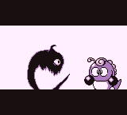
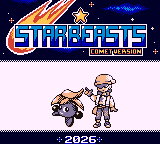
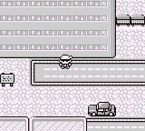
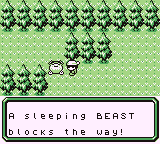
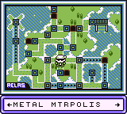
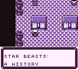
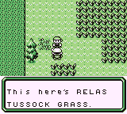
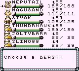
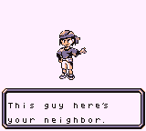
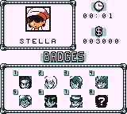
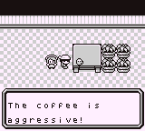
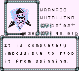
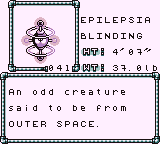
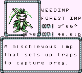
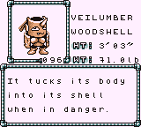
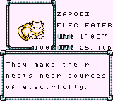
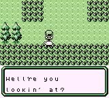
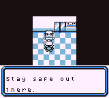
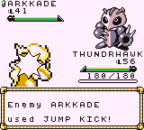
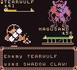
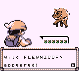
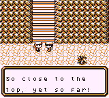
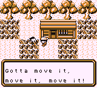
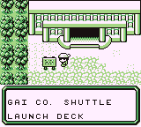
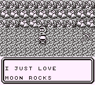
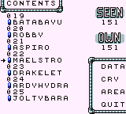
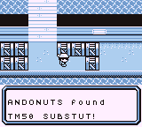
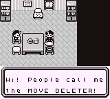
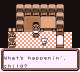
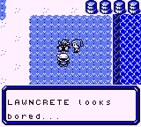
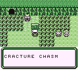
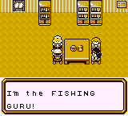
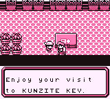
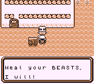
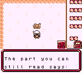
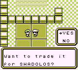

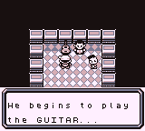
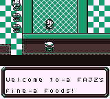
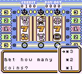
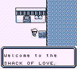
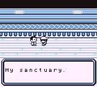
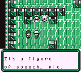
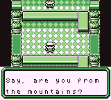
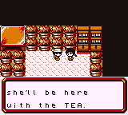
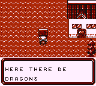
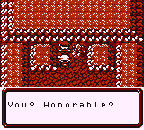
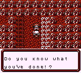
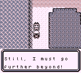

## __Credits:__

- Vast Fame for majority of original sprites
- Mufeet for new sprites, improved sprites, most of the monster backsprites, trainer sprites, etc
- IceDragonsDen for the protag design
- Mauve Sea for the title screen, current logo, border, several monster sprites and redesigns and a lot of backsprites, a handful of trainer sprites, many overworld sprites, as well as nearly all of the new tilesets (including the new text border), and a whole lot of other sprite based art
- PrismaPurple for Lisbeth's design
- DevilRedd and Mufeet for the old Star Beasts logo
- YeOldeLoreMonger for designing the town layouts and feedback on the overworld and world map
- Waffl'M for Bloodstone Bay Hermit sprites
- Farfromtile / Tilemahosbra for Tile
- Game Freak for Pokemon Red
- Pret for the Pokered disassembly on GitHub, without which this wouldn't have been possible
- Dannye for Pokered-Crysaudio, and EXP Bar code
- jojobear13 for TMs and HMs displaying names code, as well as a bunch of other code from Shin Pokemon
- ShiraTheMogul for "Bottle Cap" code
- Vortiene for help with coding new overworld encounters and areas, improved level-up code, a whole lot of other things
- Xillicis for fixing the inventory code, and the new rival encounter
- All of our wonderful playtesters

## __FAQ:__
Q: The game's too hard!
A: There are multiple new in-game trades and overworld encounters explicitly designed to make the game easier. If you're stuck, try taking a different path and seeing what you find.

Q: I picked up Exp. All and now the game's too easy!
A: Exp. All in this game works the way Exp Share does in later gens. 
     It is functionally an "easy mode." If you want a challenge, don't pick it up.

Q: Is there more content than vanilla gen 1?
A: There's less "mandatory" content than vanilla gen 1, but there should be considerably more to find and do.

Q: How do I move that one boulder that's too heavy to move?
A: You don't and can't.

Q: Why does the map show Beast locations in areas I can't access?
A: Engine limitations.

Q: Where the heck is the Cyberscope?
A: Talk to the person that has it after you defeat them and they'll drop it.

Q: Where is CUT?
A: On the S.S. Rubin in Legrandito.

**[Beast Documentation](https://github.com/StarBeasts/Star-Beasts-Comet/blob/master/docs/Beast%20Information%20%26%20Locations%20-%20Spoilers.txt)**
